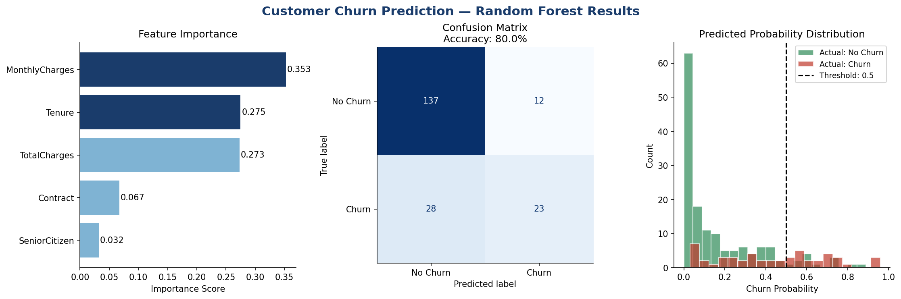

# 🌲 Customer Churn Prediction — Random Forest Classifier

> Predicting telecom customer churn using Random Forest ensemble learning with full EDA, feature engineering, and model evaluation.


---

## 🎯 Problem Statement

Predict whether a telecom customer will **churn (leave)** or **stay** based on their usage patterns, contract type, and demographic data. Customer churn directly impacts revenue — retaining customers is 5–7x cheaper than acquiring new ones.

---

## 🔬 What is Random Forest?

Random Forest is an **ensemble learning algorithm** that builds multiple Decision Trees and combines their predictions for higher accuracy and robustness.

- ✅ Works for both **classification and regression**
- ✅ Handles **missing values and outliers** well
- ✅ Provides **feature importance** rankings
- ✅ Reduces **overfitting** compared to single Decision Trees

---

## 📋 ML Pipeline

```
Raw Data → EDA → Data Cleaning → Feature Encoding → Train/Test Split → Random Forest → Evaluation
```

| Step | Details |
|---|---|
| Dataset | 7,043 rows × 21 columns |
| Target | Churn (Yes/No) |
| Data Cleaning | Null handling, TotalCharges type conversion |
| Encoding | Label encoding for categorical features |
| Model | RandomForestClassifier (Scikit-learn) |
| Evaluation | Accuracy, Confusion Matrix, Classification Report |

---

## 📁 Project Structure

```
customer-churn-random-forest/
├── customer_churn_random_forest.ipynb    # Full ML notebook
└── README.md                             # Project documentation
```

---

## 🛠️ Tech Stack

- **Python 3.x**
- **Pandas & NumPy** — data preprocessing
- **Matplotlib & Seaborn** — EDA visualizations
- **Scikit-learn** — Random Forest, train-test split, metrics

---

## 🚀 How to Run

1. Clone the repository
```bash
git clone https://github.com/sidducv0528/customer-churn-random-forest.git
cd customer-churn-random-forest
```

2. Install dependencies
```bash
pip install pandas numpy matplotlib seaborn scikit-learn jupyter
```

3. Open notebook
```bash
jupyter notebook customer_churn_random_forest.ipynb
```

> **Dataset:** IBM Telco Customer Churn — [View Dataset](https://drive.google.com/file/d/1isrr7u_yfh69vSUAMD9oMY2P_x2YnhTu/view)

---

## 👤 Author

**Siddu Varikuppala**
- 🎓 B.Sc (Honours) | Data Science Enthusiast | Hyderabad
- 💼 [LinkedIn](https://www.linkedin.com/in/siddu-data/)
- 💻 [GitHub](https://github.com/sidducv0528)

---

> *Part of my Data Science & ML portfolio — trained under IIT Roorkee Data Science Programme (Intellipaat)*

---


---

## 📂 Dataset Included

| File | Rows | Columns | Description |
|---|---|---|---|
| `telco_churn_sample.csv` | 500 | 18 | Sample Telco customer churn data — ready to run! |

**Full dataset:** [IBM Telco Customer Churn — Kaggle](https://www.kaggle.com/blastchar/telco-customer-churn)

## 📸 Output Screenshots



*Charts showing: Feature importance ranking, Confusion matrix (Accuracy: 80%), Predicted churn probability distribution*
